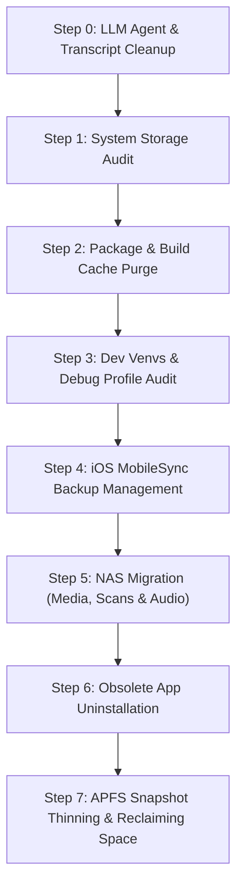

# Generalized MacBook Disk Space Cleanup Workflow

A systematic, high-yield workflow for reclaiming tens to hundreds of gigabytes of disk space on macOS.

---

## Workflow Overview



---

## 1. Step 0: LLM Agent & Session History Cleanup *(Pre-requisite)*

Before conducting system-wide cleanup, purge accumulated logs, cached transcripts, and temporary workspace artifacts generated by AI/LLM agent frameworks:

* **Agent Logs & Transcripts**: Clean old agent conversation transcripts and scratch files (`<appDataDir>/brain/<conversation-id>/`, `.system_generated/logs/`, `~/.config/<llm-cli>/brain/`, `.claude/`).
* **LLM Cache Dumps**: Clear local LLM server model response caches and temporary prompt execution logs.

---

## 2. Step 1: System Storage Audit & Identification

Perform a rapid, non-destructive audit of disk usage and major directory sizes:

```bash
# Check overall filesystem capacity
df -h /

# Scan top-level user directories & caches
du -sh ~/* ~/Library/* ~/.cache/* 2>/dev/null | sort -rh | head -n 25

# Locate large files (> 100 MB)
find ~/Downloads ~/Documents -type f -size +100M -exec ls -lh {} + 2>/dev/null | sort -rh -k5
```

---

## 3. Step 2: Package Manager & Build Cache Purge

Reclaim storage held by developer package managers and browser automation binaries (often 15–30+ GB):

```bash
# 1. Python package caches (uv & pip)
uv cache clean
pip cache purge

# 2. Homebrew bottle & download caches
brew cleanup --prune=all

# 3. Node.js & Playwright/Puppeteer caches
npm cache clean --force
rm -rf ~/Library/Caches/ms-playwright ~/.cache/puppeteer

# 4. Browser web caches
rm -rf ~/Library/Caches/Google/* ~/Library/Caches/node-gyp/*
```

---

## 4. Step 3: Dev Virtual Environments & Debug Profile Audit

Target hidden space hogs created during software development and browser extension testing:

1. **Browser Debugging Profiles**: Delete extension testing profiles (`<project>/chrome-debug-profile/`). Chrome debug profiles automatically download multi-gigabyte machine learning models (such as **Gemini Nano** `OptGuideOnDeviceModel/weights.bin` ~4.0 GB).
2. **Stray `node_modules` & Inactive `.venv`**: Scan for accidental `~/node_modules` in the home root and delete inactive Python `.venv` environments across projects (can be recreated on demand via `uv venv`).

---

## 5. Step 4: iOS MobileSync Backup Management

iOS backups created via Finder/iTunes are stored in `~/Library/Application Support/MobileSync/Backup2/` and often hold 50–150+ GB of stale data:

1. **Read Metadata**: Inspect `Info.plist` files inside each backup folder to identify Device Name, iOS Version, and Last Backup Date.
2. **Action**: Delete 3+ year old backups or move them to external NAS storage (`/Volumes/<nas_share>/ios_backups/`). Keep only the most recent active device backup.

---

## 6. Step 5: NAS Migration (Media, Medical Datasets & Audio)

Transfer large, historical, or non-daily files off the local Mac SSD to NAS storage:

* **Dashcam & Vehicle Recordings**: Move dashcam video clips (`FILE*.MP4`, `*.MOV`) to `/Volumes/<nas_share>/dashcam/` and purge local copies.
* **Educational & Journal Audio**: Cross-reference local audio zips/folders (`~/Documents/<audio_resources>`) against NAS (`/Volumes/<nas_share>/music/` & `/Volumes/<nas_share>/learning/`), unzipping and aligning missing issues into structured journal folders before deleting local archives.
* **Medical Datasets & Photos**: Offload PACS DICOM databases, MATLAB `.mat` matrix files, and photo archives (`~/Documents/PhotosArchive`) to NAS.

---

## 7. Step 6: Application Uninstallation & Channel Cleanup

Audit `/Applications` for obsolete or duplicate software:

* **Legacy Software**: Remove 10-year-old software releases (e.g. legacy MATLAB versions), sunsetted text editors (Atom), legacy Teams clients, and obsolete jailbreak tools (Cydia Impactor).
* **Duplicate Browsers**: Remove unused secondary browser testing builds (e.g. Chrome Beta / Chrome Canary).
* **Unused VPN & Remote Access Clients**: Remove overlapping VPN or remote desktop clients (`Webex`, `TeamViewer`, `VMware Horizon`).

---

## 8. Step 7: APFS Snapshot Thinning (Releasing Purgeable Space)

After deleting large volumes of data, macOS APFS holds deleted blocks inside **Local Time Machine Snapshots** (`com.apple.TimeMachine...local`), causing Disk Utility to show the freed space as "Purgeable" rather than "Free".

Run this command to force APFS to release all snapshot-locked blocks back to active Free Space:

```bash
# Force APFS to release purgeable snapshot blocks
tmutil thinlocalsnapshots / 999999999999 4

# Verify updated live free space
df -h /
diskutil info / | grep -iE "Free|Purgeable|Available"
```

---

### Signature
- **Model**: Gemini 3.6 Flash
- **Timestamp**: 2026-07-23T22:09:55+08:00
